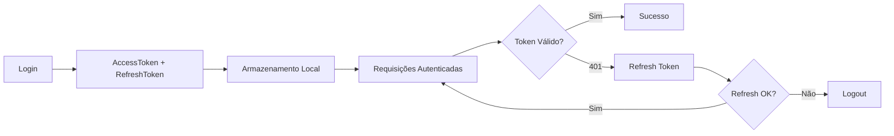

# Arquitetura - Alpha Steel Web

## Stack Tecnológica

- **Frontend Framework**: React 19.2.0 + TypeScript
- **Build Tool**: Vite 7.2.4
- **Roteamento**: React Router DOM 7.13.0
- **Ícones**: Lucide React 0.563.0
- **Testes E2E**: Cypress 15.10.0
- **Formatação**: React Number Format 5.4.4

## Estrutura do Projeto

```
src/
├── api/                    # Camada de comunicação com backend
│   ├── http.ts            # Cliente HTTP com interceptor e refresh token
│   ├── authApi.ts         # Endpoints de autenticação
│   ├── productsApi.ts     # Endpoints de produtos
│   ├── rawMaterialsApi.ts # Endpoints de matérias-primas
│   ├── productionApi.ts   # Endpoints de produção
│   └── unitsOfMeasureApi.ts
│
├── auth/                   # Sistema de autenticação
│   ├── AuthContext.tsx    # Contexto de autenticação
│   ├── ProtectedRoute.tsx # Componente para rotas protegidas
│   └── tokenStorage.ts    # Gerenciamento de tokens
│
├── components/            # Componentes reutilizáveis
│   ├── layout/           # Componentes de layout
│   ├── Toast.tsx         # Notificações
│   ├── ToastContainer.tsx
│   ├── OverlayCard.tsx   # Card modal
│   └── ForgotPasswordModal.tsx
│
├── context/               # Contextos globais
│   ├── ThemeContext.tsx  # Tema claro/escuro
│   └── ToastContext.tsx  # Sistema de notificações
│
├── pages/                 # Páginas da aplicação
│   ├── LandingPage.tsx
│   ├── AuthPage.tsx
│   ├── DashboardLayout.tsx
│   ├── ProductsPage.tsx
│   ├── RawMaterialsPage.tsx
│   ├── ProductionPage.tsx
│   ├── UnitsOfMeasurePage.tsx
│   ├── ProfilePage.tsx
│   ├── ResetPasswordPage.tsx
│   └── NotFoundPage.tsx
│
├── types/                 # Definições de tipos TypeScript
│   └── models.ts
│
├── css/                   # Estilos globais e modulares
│
├── assets/                # Recursos estáticos
│
├── app/                   # Configuração de rotas
│   └── AppRouter.tsx
│
├── App.tsx               # Componente raiz
└── main.tsx              # Ponto de entrada
```

## Principais Funcionalidades

### 1. Sistema de Autenticação

- Login/Logout com JWT
- Refresh Token automático
- Recuperação de senha
- Rotas protegidas
- Redirecionamento automático em caso de sessão expirada

**Fluxo de Autenticação:**



### 2. Cliente HTTP com Interceptor

O módulo `http.ts` implementa:

- Tratamento centralizado de erros
- Refresh token automático em 401
- Normalização de tokens Bearer
- Extração inteligente de mensagens de erro
- Prevenção de múltiplos refreshes simultâneos

### 3. Gerenciamento de Estado

- **AuthContext**: Autenticação do usuário
- **ThemeContext**: Tema claro/escuro
- **ToastContext**: Sistema de notificações

### 4. Páginas Principais

#### Gestão de Produtos

- **ProductsPage**: CRUD de produtos com filtros e ordenação
- **RawMaterialsPage**: Gerenciamento de matérias-primas
- **UnitsOfMeasurePage**: Unidades de medida

#### Produção

- **ProductionPage**: Interface para planejamento de produção

#### Administração

- **ProfilePage**: Perfil do usuário
- **DashboardLayout**: Layout principal do dashboard

## Padrões de Projeto

### Comunicação com API

Todas as chamadas à API seguem o padrão:

```typescript
export async function apiRequest<T>(
  path: string,
  method: HttpMethod,
  body?: unknown,
  options?: ApiRequestOptions,
): Promise<T>;
```

### Componentes Protegidos

```typescript
<ProtectedRoute>
  <ComponenteProtegido />
</ProtectedRoute>
```

### Sistema de Notificações

```typescript
const { showToast } = useToast();
showToast("Mensagem", "success");
```

## Variáveis de Ambiente

```env
VITE_API_BASE_URL=http://localhost:8080/api/v1
```

## Scripts Disponíveis

- `npm run dev` - Servidor de desenvolvimento
- `npm run build` - Build de produção
- `npm run preview` - Preview do build
- `npm run lint` - Verificação de código

## Convenções de Código

- Código e comentários em inglês
- Nomes de arquivos em PascalCase para componentes (`.tsx`)
- Nomes em camelCase para utilities (`.ts`)
- CSS modular organizado por funcionalidade
- Types centralizados em `types/models.ts`
